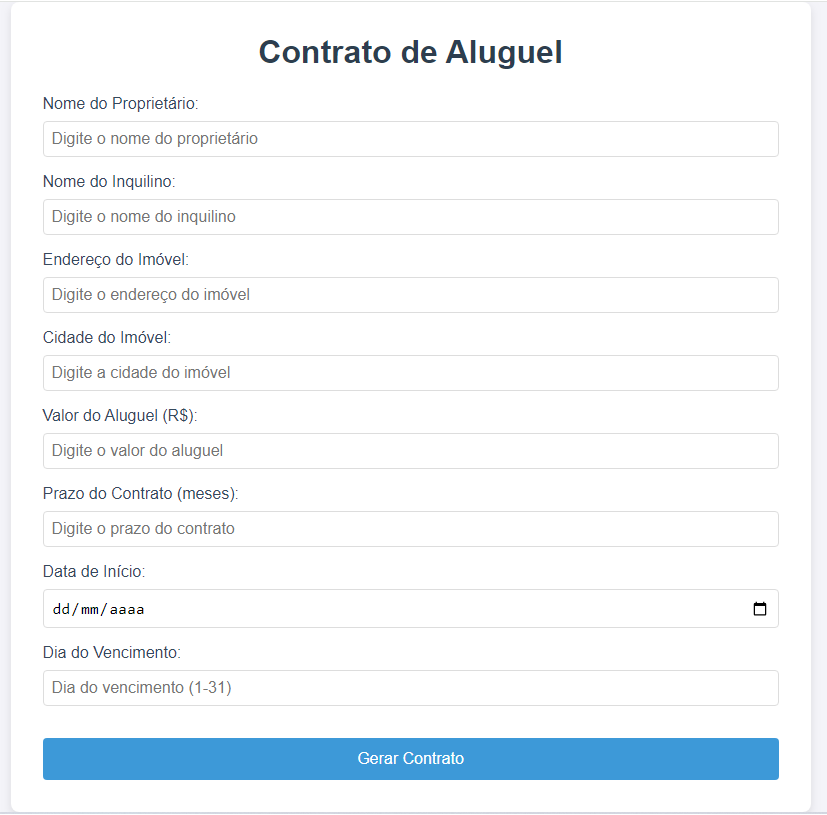

# Contrato de Aluguel Online.

Este projeto é uma aplicação Web que permite a geração de contratos de forma dinâmica e automatizada. O usuário preenche um formulário com os dados do proprietário, inquilino e detalhes do imóvel, e o sistema gera um contrato em **HTML5** e **PDF**.

---

# 🚀 Funcionalidades

- **Formulário Dinâmico:**: Coleta dados como nome, CPF, RG, endereço do imóvel, valor do aluguel, prazo do contrato, data de início e dia do vencimento.

- **Geração de Contrato em HTML:**: Exibe o contrato gerado diretamente na página, com os dados preenchidos no formulário.

- **Geração de Contrato em PDF:**: Permite baixar o contrato em formato PDF, com margens adequadas, título centralizado e quebra de página automática.

- **Validação de Campos:**: Todos os campos do formulário são obrigatórios, garantindo que nenhuma informação essencial seja omitida.
---
## 🛠️ Tecnologias Utilizadas

**HTML5:**
- Estrutura da página e formulário.

**CSS3:**
- Estilização da página e layout do contrato.

**JavaScript:**

- Lógica para gerar o contrato dinamicamente e criar o PDF.

**jsPDF:**
- Biblioteca para geração de arquivos PDF.

- **Ferramentas**:
  - Visual Studio Code (Editor de código)
  - Git (Controle de versão)

---

## 🙏 Agradecimentos
**Agradecer a Deus pelas habilidades adquiridas.**

**Agradecer a minha família por me apoiar.**

## 👨‍💻 Autor
Robson S. Ferreira
- [LinkedIn](https://www.linkedin.com/in/robson-ferreira-6539692b/)

- [GitHub](https://www.linkedin.com/in/robson-ferreira-6539692b/)

- [robsferreira@gmail.com](mailto:robsferreira@gmail.com)
---
